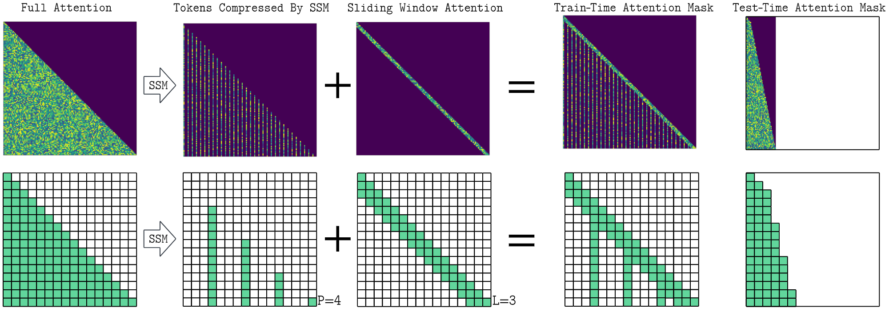
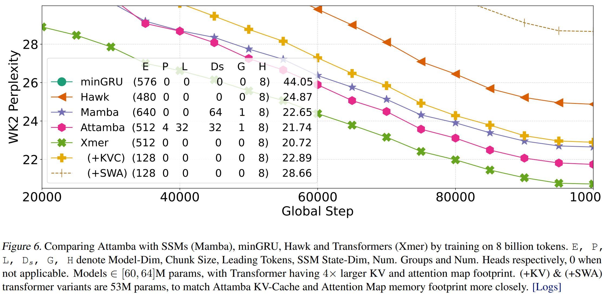

# Attamba

Code for the paper "**Attamba: Attending To Multi-Token States**"

Yash Akhauri, Safeen Huda, Mohamed S. Abdelfattah

## Overview
When predicting the next token in a sequence, vanilla transformers compute attention over all previous tokens, resulting in quadratic scaling of compute with sequence length. State-space models compress the entire sequence of tokens into a fixed-dimensional representation to improve efficiency, while other architectures achieve sub-quadratic complexity via low-rank projections or sparse attention patterns over the sequence. In this paper, we introduce Attamba, a novel architecture that uses state-space models to compress chunks of tokens and applies attention on these compressed key-value representations. We find that replacing key and value projections in a transformer with SSMs can improve model quality and enable flexible token chunking, resulting in 24% improved perplexity with transformer of similar KV-Cache and attention footprint, and ≈4× smaller KV-Cache and Attention FLOPs for 5% perplexity trade-off. Attamba can perform attention on chunked-sequences of variable length, enabling a smooth transition between quadratic and linear scaling, offering adaptable efficiency gains. 




## Code release in progress

The code release is still in progress, but all our experiments should be reproducible from this repository. This repository builds on top of Meta-Lingua to implement Attamba. Relevant config files and code is located in apps/attamba, as well as eval-time patches in `lm_eval_instructions.md`. It is recommended to clone [lm-eval-harness](https://github.com/EleutherAI/lm-evaluation-harness) and applying the `lm_eval_changes.patch` to enable WikiText2 evaluation. As this relies on an older commit from lingua (experimental framework still in development), other downstream-evaluations are not reliable. We are working on fixing these bugs and training larger models with a more thorough downstream task and long-bench evaluation.


## Setup

Follow the setup steps specified [here](https://github.com/facebookresearch/lingua).

We train on a single A6000 GPU, which means we only train on `dclm_baseline_1.0.chunk.00.jsonl`, which is around 13B tokens. Our results are reported on training runs between 1B and 8B tokens.

Appropriate config files are located in ablation_backup, as well as `apps/attamba/configs/ablation_configs`.

## Reproduce Results

All of our runs are stored in `ablation_backup`

**Figure**: Performance comparison of Attamba vs. a parameter-matched transformer baseline with smaller KV-Cache and Sliding Window Attention (SWA). Attamba outperforms the baseline significantly.  Reproduce by running `python iso_wk2gen.py comparative_runs`


<!--  -->
**Figure**: Reproduce by running `python collated_wk2_gen.py  long_runs`



## Acknowledgement

```
@misc{meta_lingua,
  author = {Mathurin Videau, Badr Youbi Idrissi, Daniel Haziza, Luca Wehrstedt, Jade Copet, Olivier Teytaud, David Lopez-Paz},
  title = {{Meta Lingua}: A minimal {PyTorch LLM} training library},
  url = {https://github.com/facebookresearch/lingua},
  year = {2024}
}
```

## Citing

If you use Attamba in your research, please cite our paper:

```
@misc{akhauri2024attambaattendingmultitokenstates,
      title={Attamba: Attending To Multi-Token States}, 
      author={Yash Akhauri and Safeen Huda and Mohamed S. Abdelfattah},
      year={2024},
      eprint={2411.17685},
      archivePrefix={arXiv},
      primaryClass={cs.LG},
      url={https://arxiv.org/abs/2411.17685}, 
}
```